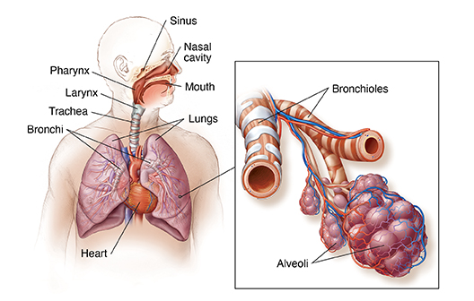

# Modeling-and-simulation-of-asthma
This project aims to develop a computational model to simulate and study the dynamics of asthma, providing insights into its behavior and potential interventions.

This README provides an overview of our project's goals, approach, results, testing procedures, and usage instructions. Navigate through the sections below to learn more about each aspect of the project.
- [Introduction](#introduction)
- [Mathematical Modeling Approach](#mathematical-modeling-approach)
- [Results](#results)
- [Testing](#testing)
- [Usage](#usage)
- [Contribution Guidelines](#contribution-guidelines)
- [License](#license)
- [Contact](#contact)

## Introduction

The consumption of oxygen and the production of carbon dioxide are essential for generating the necessary amount of energy for each individual. Therefore, the human body requires a system that ensures this process. We are talking about the respiratory system.
The respiratory system consists of respiratory pathways that facilitate the exchange of air between the lungs and the atmosphere (nasal cavity, trachea, etc.) and intrapulmonary pathways that carry air from the respiratory pathways to the pulmonary alveoli; these are referred to as bronchi and bronchioles. These can be affected by several diseases, including bronchitis, asthma, and bronchiectasis.

## Mathematical Modeling Approach

...

## Results

...

## Testing

...

## Usage

...

## Contribution Guidelines

...

## License

...

## Contact

...
