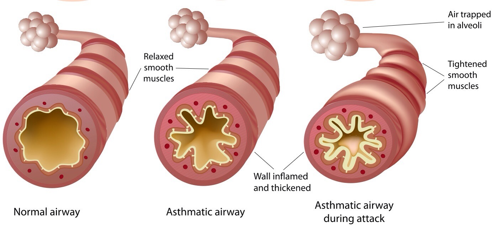

# Modeling-and-simulation-of-asthma
This project aims to develop a computational model to simulate and study the dynamics of asthma, providing insights into its behavior and potential interventions.

This README provides an overview of our project's goals, approach, results, testing procedures, and usage instructions. Navigate through the sections below to learn more about each aspect of the project.
- [Introduction](#introduction)
- [Problem Statement and Model Overview](#problem-statement-and-model-overview)
- [Mathematical Modeling Approach](#mathematical-modeling-approach)
- [Results](#results)
- [Testing](#testing)
- [Usage](#usage)
- [Contribution Guidelines](#contribution-guidelines)
- [License](#license)
- [Contact](#contact)

## Introduction

  

The consumption of oxygen and the production of carbon dioxide are essential for generating the necessary amount of energy for each individual. Therefore, the human body requires a system that ensures this process. We are talking about the respiratory system.
The respiratory system consists of respiratory pathways that facilitate the exchange of air between the lungs and the atmosphere (nasal cavity, trachea, etc.) and intrapulmonary pathways that carry air from the respiratory pathways to the pulmonary alveoli; these are referred to as bronchi and bronchioles. These can be affected by several diseases, including bronchitis, asthma, and bronchiectasis.

  

Asthma, derived from the Greek word "Azein" meaning to breathe with difficulty, is an allergic respiratory issue that causes chronic inflammation of the airways. It's marked by recurring episodes of wheezing and breathing difficulty. Asthma symptoms involve three pathological processes: 

- **Chronic Airway Inflammation:** Asthma primarily develops due to an inflammatory reaction of the bronchial lining. Various inflammatory cells and mediators contribute to the distinctive pathological changes. This airway inflammation is closely tied to early-life exposures, hyperreactivity, and asthmatic symptoms. In cases of asthma, inflammation persists even during episodic symptoms. Notably, bronchial mast cells, eosinophils, lymphocytes, dendritic cells, macrophages, and neutrophils play significant roles in this inflammatory response.

- **Bronchial Hyperreactivity:** Asthmatic individuals exhibit bronchial hyperreactivity as their disease progresses, rendering the bronchial system overly sensitive and prone to contraction upon exposure to specific triggers such as allergens, viruses, and cold air. This hyperreactivity is associated with airway inflammation and can be partially reversible through medical treatment.

- **Bronchial Obstruction:** Airflow restriction in asthma primarily results from the abrupt narrowing of bronchial passages. This obstruction is mainly due to spasms in the smooth bronchial muscles. Additionally, edema, thickening of bronchial walls, and excessive mucus production contribute to airway constriction.

## Problem Statement and Model Overview

### Problem Statement

During this project, our objective is to establish a model that faithfully reproduces the airflow patterns. Initially, we will create a model for airflow within a cylindrical bronchus and then extend it to account for the deformation of bronchial walls as observed in asthma cases. For each distinct geometry, we will explore the quantification of increased bronchial airway resistance.

### Model Overview

Our modeling approach begins by representing the bronchus as a rectangle. We set the pressure at both the inlet and outlet of the rectangle, then observe variations in the velocity field, pressure, and airway resistance. We subsequently introduce geometry modifications to the tube and compare the resulting outcomes.

### Study Assumptions

To facilitate our study, we make the following assumptions:

- The airflow is laminar and conservative.
- The airflow is in a steady-state.
- The inertia term is considered negligible.
- The fluid is treated as incompressible.

## Mathematical Modeling Approach

Since we are studying the airflow within the bronchial tubes, involving a Newtonian fluid, and considering the assumptions mentioned earlier, we work within the framework of the Stokes approximation. The equation we will solve is:

$$
-\nabla P + \mu \nabla^2 \mathbf{u} = \mathbf{0}
$$

Here, $\mu$ represents the fluid viscosity (air in our case). By incorporating the equation of mass conservation:

$$
\nabla \cdot \mathbf{u} = 0
$$

We obtain the following system:

$$
\begin{align*}
-\frac{\partial P}{\partial x} + \mu \left( \frac{\partial^2 u_x}{\partial x^2} + \frac{\partial^2 u_x}{\partial y^2} \right) &= 0 \\
-\frac{\partial P}{\partial y} + \mu \left( \frac{\partial^2 u_y}{\partial x^2} + \frac{\partial^2 u_y}{\partial y^2} \right) &= 0 \\
\frac{\partial u_x}{\partial x} + \frac{\partial u_y}{\partial y} &= 0
\end{align*}
$$

To solve this system, we will employ the finite element method. We discretize our rectangular surface into a grid with steps $dx$ along the horizontal axis and $dy$ along the vertical axis. At each point with coordinates $(i,j)$, we associate the function $i + jk$, where 
$0 \leq k < M$. Here, $M$ is the width of the rectangle, and $N$ is its length.

To numerically solve our problem, we transition to the discrete case by applying our equations, valid in a continuous domain, at each point of the discretization.

### Case 1: Poiseuille Flow

In this case, we aimed to simulate Poiseuille flow, which corresponds to 2D flow without deformation. Our flow represents the solution of the system:

$$
-\nabla P + \mu \nabla^2 \mathbf{u} = \mathbf{0}
$$

where $\mathbf{u} = u_x(y) \mathbf{e}_x$ and $\nabla P = \text{constant} = \frac{\Delta P}{L}$.

Replacing the velocity formula in the Stokes equation, we find:

$$
-\frac{\partial P}{\partial x} + \mu \frac{\partial^2 u_x}{\partial y^2} = 0
$$

The velocity expression becomes: $u_x(y) = \frac{\Delta P}{2\mu L} + Ay + B$, with $A$ and $B\$ as constants.

With the boundary conditions $u_x(y=0) = u_x(y=D) = 0$, we have:

$$
u_x(y) = \frac{\Delta P}{2\mu L} y(y - D)
$$

Using this formula, we can calculate the theoretical flow rate and maximum velocity:

$$
\frac{\partial u_x}{\partial y} = 0 \Rightarrow y = \frac{D}{2} \Rightarrow u_m = u(y = D/2) = -\frac{\Delta P D^2}{8\mu L}
$$

And

$$
Q = \int_0^D u_x(y) \, dy = \int_0^D \left(\frac{\Delta P}{2\mu L} y^2 - \frac{\Delta P}{2\mu L} Dy\right) \, dy = \left[\frac{\Delta P}{6\mu L} y^3 - \frac{\Delta P}{4\mu L} Dy^2 \right]_0^D = -\frac{\Delta P D^3}{12\mu L}
$$

These formulas serve as a means to verify the accuracy of our model. This will be verified later in the results' section.

## Results

### Case1: Poiseuille flow:

  
  

## Testing

...

## Usage

...

## Contribution Guidelines

...

## License

...

## Contact

...
