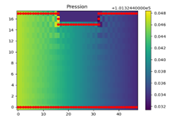

# Modeling-and-simulation-of-asthma
This project aims to develop a computational model to simulate and study the dynamics of asthma, providing insights into its behavior and potential interventions.

This README provides an overview of our project's goals, approach, results, testing procedures, and usage instructions. Navigate through the sections below to learn more about each aspect of the project.
- [Introduction](#introduction)
- [Problem Statement and Model Overview](#problem-statement-and-model-overview)
- [Mathematical Modeling Approach](#mathematical-modeling-approach)
- [Results](#results)
- [Testing](#testing)
- [Usage](#usage)
- [Contribution Guidelines](#contribution-guidelines)
- [License](#license)
- [Contact](#contact)

## Introduction

  

The consumption of oxygen and the production of carbon dioxide are essential for generating the necessary amount of energy for each individual. Therefore, the human body requires a system that ensures this process. We are talking about the respiratory system.
The respiratory system consists of respiratory pathways that facilitate the exchange of air between the lungs and the atmosphere (nasal cavity, trachea, etc.) and intrapulmonary pathways that carry air from the respiratory pathways to the pulmonary alveoli; these are referred to as bronchi and bronchioles. These can be affected by several diseases, including bronchitis, asthma, and bronchiectasis.

  

Asthma, derived from the Greek word "Azein" meaning to breathe with difficulty, is an allergic respiratory issue that causes chronic inflammation of the airways. It's marked by recurring episodes of wheezing and breathing difficulty. Asthma symptoms involve three pathological processes: 

- **Chronic Airway Inflammation:** Asthma primarily develops due to an inflammatory reaction of the bronchial lining. Various inflammatory cells and mediators contribute to the distinctive pathological changes. This airway inflammation is closely tied to early-life exposures, hyperreactivity, and asthmatic symptoms. In cases of asthma, inflammation persists even during episodic symptoms. Notably, bronchial mast cells, eosinophils, lymphocytes, dendritic cells, macrophages, and neutrophils play significant roles in this inflammatory response.

- **Bronchial Hyperreactivity:** Asthmatic individuals exhibit bronchial hyperreactivity as their disease progresses, rendering the bronchial system overly sensitive and prone to contraction upon exposure to specific triggers such as allergens, viruses, and cold air. This hyperreactivity is associated with airway inflammation and can be partially reversible through medical treatment.

- **Bronchial Obstruction:** Airflow restriction in asthma primarily results from the abrupt narrowing of bronchial passages. This obstruction is mainly due to spasms in the smooth bronchial muscles. Additionally, edema, thickening of bronchial walls, and excessive mucus production contribute to airway constriction.

## Problem Statement and Model Overview

### Problem Statement

During this project, our objective is to establish a model that faithfully reproduces the airflow patterns. Initially, we will create a model for airflow within a cylindrical bronchus and then extend it to account for the deformation of bronchial walls as observed in asthma cases. For each distinct geometry, we will explore the quantification of increased bronchial airway resistance.

### Model Overview

Our modeling approach begins by representing the bronchus as a rectangle. We set the pressure at both the inlet and outlet of the rectangle, then observe variations in the velocity field, pressure, and airway resistance. We subsequently introduce geometry modifications to the tube and compare the resulting outcomes.

### Study Assumptions

To facilitate our study, we make the following assumptions:

- The airflow is laminar and conservative.
- The airflow is in a steady-state.
- The inertia term is considered negligible.
- The fluid is treated as incompressible.

## Mathematical Modeling Approach

Since we are studying the airflow within the bronchial tubes, involving a Newtonian fluid, and considering the assumptions mentioned earlier, we work within the framework of the Stokes approximation. The equation we will solve is:

$$
-\nabla P + \mu \nabla^2 \mathbf{u} = \mathbf{0}
$$

Here, $\mu$ represents the fluid viscosity (air in our case). By incorporating the equation of mass conservation:

$$
\nabla \cdot \mathbf{u} = 0
$$

We obtain the following system:

$$
\begin{align*}
-\frac{\partial P}{\partial x} + \mu \left( \frac{\partial^2 u_x}{\partial x^2} + \frac{\partial^2 u_x}{\partial y^2} \right) &= 0 \\
-\frac{\partial P}{\partial y} + \mu \left( \frac{\partial^2 u_y}{\partial x^2} + \frac{\partial^2 u_y}{\partial y^2} \right) &= 0 \\
\frac{\partial u_x}{\partial x} + \frac{\partial u_y}{\partial y} &= 0
\end{align*}
$$

To solve this system, we will employ the finite element method. We discretize our rectangular surface into a grid with steps $dx$ along the horizontal axis and $dy$ along the vertical axis. At each point with coordinates $(i,j)$, we associate the function $i + jk$, where 
$0 \leq k < M$. Here, $M$ is the width of the rectangle, and $N$ is its length.

To numerically solve our problem, we transition to the discrete case by applying our equations, valid in a continuous domain, at each point of the discretization.

### Case 1: Poiseuille Flow

In this case, we aimed to simulate Poiseuille flow, which corresponds to 2D flow without deformation. Our flow represents the solution of the system:

$$
-\nabla P + \mu \nabla^2 \mathbf{u} = \mathbf{0}
$$

where $\mathbf{u} = u_x(y) \mathbf{e}_x$ and $\nabla P = \text{constant} = \frac{\Delta P}{L}$.

Replacing the velocity formula in the Stokes equation, we find:

$$
-\frac{\partial P}{\partial x} + \mu \frac{\partial^2 u_x}{\partial y^2} = 0
$$

The velocity expression becomes: $u_x(y) = \frac{\Delta P}{2\mu L} + Ay + B$, with $A$ and $B\$ as constants.

With the boundary conditions $u_x(y=0) = u_x(y=D) = 0$, we have:

$$
u_x(y) = \frac{\Delta P}{2\mu L} y(y - D)
$$

Using this formula, we can calculate the theoretical flow rate and maximum velocity:

$$
\frac{\partial u_x}{\partial y} = 0 \Rightarrow y = \frac{D}{2} \Rightarrow u_m = u(y = D/2) = -\frac{\Delta P D^2}{8\mu L}
$$

And

$$
Q = \int_0^D u_x(y) \, dy = \int_0^D \left(\frac{\Delta P}{2\mu L} y^2 - \frac{\Delta P}{2\mu L} Dy\right) \, dy = \left[\frac{\Delta P}{6\mu L} y^3 - \frac{\Delta P}{4\mu L} Dy^2 \right]_0^D = -\frac{\Delta P D^3}{12\mu L}
$$

These formulas serve as a means to verify the accuracy of our model. This will be verified later in the results' section.

### Case 2: Tube with a single constriction
In the pursuit of modeling the asthma problem and after studying the simplistic scenario of a straight tube, we introduce a single constriction to our tube. In this initial step, the constriction has a width of $\epsilon_2$ and a length of $\epsilon_1$. Our tube takes on the following form:

  

To model the fluid flow inside the tube, we need to formulate the flow equations along with appropriate boundary conditions to obtain plausible results. The equations and boundary conditions we have chosen are as follows:

  

The results are shown in the following section.

## Results

### Case1: Poiseuille flow:

  
  

Firstly, we observe that the Y-component is zero, and there is no variation in velocity along the X-direction, which is consistent with Poiseuille flow. Additionally, as seen in the figures below, we note that the pressure is linear, once again in accordance with Poiseuille flow.

  
  

But, this isn't enough; we need to verify the values of the maximum velocity and flow rate before confirming. According to the formulas derived earlier, for the 4th generation:

$$Umax = 0.22 m/s \text{ and } Q = 0.0011 m²/s.$$

This also aligns with what is depicted in our plots. Finally, for an additional confirmation, we plot the velocity profile and observe that it exactly matches that of Poiseuille flow.

  

### Case 2: Tube with a single constriction 

We populate the matrix with the equations indicated in Figure 2, discretized in the same manner as in the first case. Solving the matrix equation yields the following velocity and pressure profiles:

  
  

The result of solving our matrix system indeed reveals plausible profiles. The velocity likely increases within the constriction, which aligns with the conservation of flow inside the tube. Similarly, the pressure decreases from the inlet value to the outlet value. Both figures lead to two observations:

1. Can we improve our solver to obtain smoother solutions with fewer grid artifacts during display?
2. Have we properly solved our system? In other words, do the recovered profiles indeed satisfy A.X = B?

The answer to the second question seems more straightforward. In fact, we compute the norm of the vector AX - B: ‖AX -  B‖: `/Tests/verifying the solution.py` we find that it's indeed equal to 0. Thus, the two retrieved profiles are indeed solutions to our problem.

For the second question, the answer requires some effort. The issue of grid artifacts in the middle arises from using centered differences when discretizing the equations. The solution is to replace them with one-sided differences, but life isn't as simple! Centered differences allow us to achieve more accurate solutions that preserve flow (99% accuracy). Therefore, Question 1 boils down to finding a compromise between flow conservation and solution smoothness (lack of grid artifacts). We introduce a factor $\alpha$ that belongs to the interval $[0,1]$, which from this point forward plays a crucial role in solving our problem. $\alpha$ helps us define a new derivative, introduced as follows:
$$(dg_i)/dx_{new}=α.(g_{i+1}-g_{i-1})/(2.dx)+(1-α).(g_i-g_{i-1})/dx$$

This new form of the derivative ensures two major objectives: maximizing flow conservation and presenting a smoother solution with fewer grid artifacts.

Our study led us to a factor α=0.9, and the solution obtained with `2D case with one tightening.py` after introducing this factor is as follows:

  
  

With α=0.9, the variation in flow is 1.13%, and the solutions are smoother than before.

Tests will be run on this solution in the following section.

### Case 3: Tube with several constrictions

This time, we focus on the case of a tube with multiple constrictions to approach the scenario of a bronchus affected by asthma. We manage to obtain the following velocity and pressure profiles using `2D case with one tightening.py`:

  
  

We notice that the velocity increases in the constriction area and then decreases as the tube widens again. As for pressure, it decreases while traversing the tube from the inlet to the outlet.

From these obtained results, we successfully calculated the flow rate in an asthmatic person **(0.00125 m² s⁻¹)** and deduced the resistance value **(11.67 SI units)**. By comparing these values with those of a normal person, we observe that the flow rate in an asthmatic person decreases by a percentage of **76%**.

We then managed to find the equivalent straight tube for the deformed one that maintains the same flow rate. This tube has a diameter of **D=0.00487 m**.

## Testing

### Case 2: Tube with one constriction:

Now that we have established the general profile of our solution, it's time to conduct a study on this solution to gather more insights:

Firstly, we ensure the validity of our visual observations. The Poiseuille profile outside the constriction and the modification within the constriction must be verified. To do this, we plot the velocity curve across several cross-sections before, during, and after the constriction. The result with `/Tests/velocity's evolution.py` is as follows:

  

We observe that before the constriction, the velocity followed a Poiseuille profile: the parabola associated with the equation $y = ax^2 + bx + c$. During the constriction, the velocity profile gradually deviates from the Poiseuille profile. At the exit of the constriction, the profile gradually returns once again toward the Poiseuille profile. This study is crucial to ensure the validity of the local Poiseuille profile throughout a sufficiently long portion of the tube where there is no deformation.

We now move on to the study of the flow rate, a crucial parameter. We have plotted the evolution of the inlet flow rate and the average flow rate as a function of mesh size. The result is as follows:

  

We notice that the flow rate increases with the mesh size. For N=100, the flow rate starts to converge towards its limiting value. This suggests that N=100 is a good mesh size choice that balances both program execution speed and a value close to the limiting flow rate. Another observation from this curve is that for relatively small mesh sizes (around 10 to 20), the flow rate seems to be constant (the curves overlap). In conclusion, it's advisable to avoid working with small mesh sizes as they often yield misleading results!

Now, we vary the dimensions of the constriction ε₁ and ε₂ and note the change in flow rate based on these dimensions. The results using `/Tests/flow rate's variation with respect to epsilon1.py` are as follows:

  

We observe that as the value of ε₁ increases, the fluid flow is increasingly blocked, and the flow rate tends towards 0. On the contrary, as the value of ε₁ approaches 0, the flow rate becomes larger and tends towards the flow rate value found for a straight tube, which was 0.001. In conclusion, the smaller the deformation, the closer the tube's behavior resembles that of a straight tube!

  

Now we move on to ε₂. We conduct a similar study using `/Tests/flow rate's variation with respect to epsilon2.py`, this time varying the value of ε₂ and observing its influence on the flow rate. As shown below, we note the change in flow rate as ε₂ changes. The narrower we make the constriction, the more the flow rate increases. This result aligns with our expectations!

## Usage

...

## Contribution Guidelines

...

## License

...

## Contact

...
